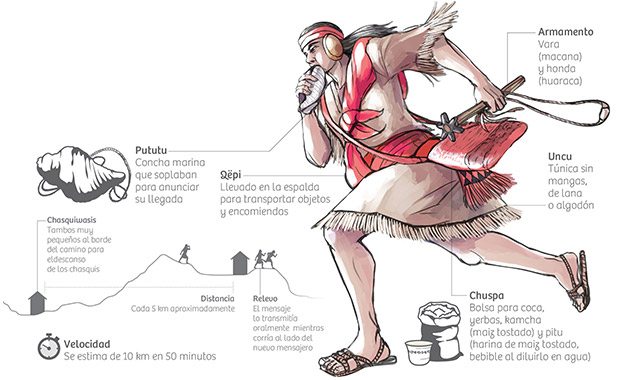

# Incan JS
A NodeJS library for handling many-to-many webhook subscriptions (also known as <a href="http://resthooks.org/">REST Hooks</a>)
The Incan Empire was known for its highly efficient messenger system despite not having horses, written writing or the wheel. They used human runners known as "Chasquis" to deliver messages stored as knots on ropes. To learn more, watch this interesting mini-doc on the .


## An overview of REST Hooks
Read Zapier's explanation of REST hooks <a href="https://zapier.com/developer/documentation/v2/rest-hooks/">here</a>

## Setup
#### Step 1:
Install with npm:
```
$ npm install --save incan-js
```

#### Step 2:
Initialize `incan-js` into your REST server by passing in 3 database functions: `addSubs`, `removeSubs`, and `querySubs`.
These functions are custom to your database solution. For more details on each, scroll down to the specs.
```
const incan = require('incan-js')
const customDB = require('../customDatabaseAPI')

// add your 3 database calls
incan.connect({
  addSubs: customDB.addFn,
  removeSubs: customDB.removeFn,
  querySubs: customDB.queryFn
})
```

#### Step 3:
Use the 3 `incan-js` functions to manage your REST hook subscriptions.
```
// incoming
const resthook_subscription = {
  client_id: 'zapier',
  resource_id: 'khan',
  event_id: 'added_friend',
  url_endpoint: 'https://hooks.zapier.com/<unique_path>'
}
const someEvent = {
  resource_id: 'khan',
  event_id: 'added_friend',
  payload: {
    target: 'khan',
    new_friend: 'david',
    added_date: 'ISO8601_datestamp',
  }
}

// your 3 incan functions
incan.addSubs([ resthook_subscription ])
incan.removeSubs([ resthook_subscription ])
incan.emit(someEvent.resource_id, someEvent.event_id, someEvent.payload)
```

## Implementation
Add a `POST /subscribe` and `POST /unsubscribe` endpoint to your REST routes so that other servers can listen to events.
```
// routes.js

app.post('/subscribe', function(err, req) {
  const newSubscriptions = req.body
  /*
    newSubscriptions = [
      {
        client_id: 'zapier',
        resource_id: 'khan',
        event_id: 'added_friend',
        url_endpoint: 'https://hooks.zapier.com/<unique_path>'
      }
    ]
  */
  incan.addSubs(newSubscriptions)
})
app.post('/unsubscribe', function(err, req) {
  const existingSubscriptions = req.body
  /*
    existingSubscriptions = [
      {
        client_id: 'zapier',
        resource_id: 'khan',
        event_id: 'added_friend'
      }
    ]
  */
  incan.removeSubs(existingSubscriptions)
})
```
Now other servers can subscribe/unsubscribe to events in your backend flow. To have `incan-js` emit an event to all listeners, simply use `incan.emit(resource_id, event_id, payload)`. `incan-js` will automatically use `querySubs()` to find matching webhook subscriptions, send out the event, and automatically unsubscribe upon any `410` responses.
```
// emit the `added_friend` event to all listeners

const addFriendToSocialNetwork = (my_name, new_friend) => {
  AztecDB.exec(`
      INSERT name
      INTO friends_table
      VALUES friend_name
    `).then((data) => {
      incan.emit(my_name, 'added_friend', data)
    })
}

addFriendToSocialNetwork('khan', 'david')
```

## Specs
The below 3 database functions must be custom made and passed in to `incan.connect()` by the developer. This allows `incan-js` to work with any persistent data store. I recommend Redis but you can use your existing SQL database, MongoDB, S3 Buckets... etc. Currently `incan-js` is limited to 1 persistent data store.

#### addSubs()
`addSubs(newSubscription)` should be a function that adds new webhook subscriptions to your database, returning a promise. Your `addSubs()` should by default accept an array.
```
const newSubscriptions = {
  client_id: '<IDENTIFIER_OF_CLIENT>',
  resource_id: '<IDENTIFIER_OF_RESOURCE>',
  event_id: '<IDENTIFIER_OF_EVENT>',
  url_endpoint: '<WEBHOOK_TO_HIT>',
}
const addSubs = (newSubscriptions) => {
  return Promise.all(newSubscriptions.map((sub) => {
    return AztecDB.exec(`
          INSERT client_id, resource_id, event_id, url_endpoint
          INTO resthook_subscriptions
          VALUES ${sub.client_id}, ${sub.resource_id}, ${sub.event_id}, ${sub.url_endpoint}
      `)
    }))
}
```
#### removeSubs()
`removeSubs(existingSubscription)` should be a function that removes webhook subscriptions from your database, returning a promise. `removeSubs()` is used by `incan-js` to delete webhooks automatically (eg. Upon a `410` response). Your `removeSubs()` should by default accept an array.
```
const existingSubscription = {
  client_id: '<IDENTIFIER_OF_CLIENT>',
  resource_id: '<IDENTIFIER_OF_RESOURCE>',
  event_id: '<IDENTIFIER_OF_EVENT>',
}
const removeSubs = (existingSubscriptions) => {
  return Promise.all(existingSubscriptions.map((sub) => {
    return AztecDB.exec(`
        DELETE FROM resthook_subscriptions
        WHERE client_id = ${sub.client_id}
        AND resource_id = ${sub.resource_id}
        AND event_id = ${sub.event_id}
    `)
  }))
}
```
#### querySubs()
`querySubs(resource_id, event_id)` should be a function that queries your database for webhook subscriptions with matching `resource_id` and `event_id`. It should return a promise with an array of matches. `incan-js` will use the `querySubs` function to fulfill any waiting webhooks. Any `POST` request to a webhook endpoint returning a `410` response will automatically unsubscribe from the webhook.
```
const querySubs = (resource_id, event_id) => {
  return AztecDB.exec(`
      SELECT FROM resthook_subscriptions
      WHERE resource_id = resource_id,
      AND event_id = event_id
  `)
}
```
